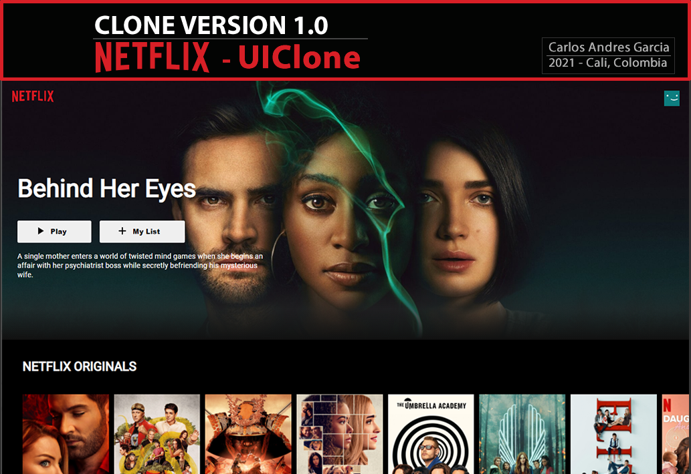

# Description to Create your Own Netflix CLone:
A Netflix clone built using React. It fetches the data from TMDB (The Movie Database) API. It also displays the movie trailers which is fetched from Youtube.
It's a Simple WEB UI Clone using HTML, CSS, ReactJS, Redux, Node, animation.
This version is still very basic, so many of the functionalities are not implemented and are only aesthetic.

### About Netflix:
Netflix, Inc. is an American over-the-top content platform and production company headquartered in Los Gatos, California. Netflix was founded in 1997 by Reed Hastings and Marc Randolph in Scotts Valley, California. The company's primary business is a subscription-based streaming service offering online streaming from a library of films and television series, including those produced in-house. In January 2021, Netflix reached 203.7 million subscribers, including 73 million in the United States. It is available worldwide except in the following: mainland China (due to local restrictions), Syria, North Korea, and Crimea (due to US sanctions). It was reported in 2020 that Netflix's operating income is $1.2 billion. The company has offices in France, Brazil, the Netherlands, India, Japan, South Korea, and the United Kingdom. Netflix is a member of the Motion Picture Association (MPA), producing and distributing content from countries all over the globe.

# To Use

1. clone repository
```sh
https://github.com/agzsoftsi/CloneVersion-Netflix.git
```

2. Go to App Directory
```sh
cd app
```

3. Run App
```sh
npm start
```


## 1. Get TMDB API key:
- a. Create a account in: [Register](https://www.themoviedb.org/signup)
- b. Go to setting in your account and Generate an API key, Select Developer, and accept contract.

Type: Website
- Fill all data requirement and submit.

- c. Test your API using Postman(Optional - Recommended)

## 2. Create React project
```sh
npx create-react-app app
```

- Run the App
```sh
cd app
npm start
```
### Fist Install Dependencies:
```sh
npm i axios
```

```sh
npm install @material-ui/icons
```

## 3. Deploy to Heroku

Ready, and that's all!!!

